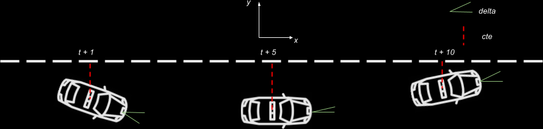

# Model Predictive Control

## Introduction
In this project, I implemented a C++ MPC (Model Predictive Control) model to control the steering angle and throttle of a vehicle running on a simulator. MPC is an advanced method of process control that has been used since the 1980's. The advantage of MPC is that it predicts the control action for the current timeslot while taking future actions into account. This is achieved by optimizing the model over a finite time horizon `'T'` with `'N'` timeslots of duration `'dt'` each (`T = N * dt`). Once the control action is applied for the current time step, the future predictions are discarded and the process is repeated again.

MPC uses a kinematic model and does not include the dynamic model. The dynamic model, which considers internal vehicle dynamics along with dynamics of a car in an environment, is not used because the car is being run in a simulator and the car internal dynamics are not obvious.

In my PID controller project (https://github.com/spgitmonish/PIDController) the cross track error is used as the input to the PID controller to control steering angle. The model PID controller is based on seems simpler when compared to MPC which has the advantage of predicting future events with a much more complex model. Thus, MPC works much better than PID and it can be seen in this project as well with the smoothness of the drive.

> **NOTE:**
> An additional advantage with MPC is that the two actuators are incorporated into the model as variables. But in case of PID, two separate controllers are required to control steering angle and throttle.

## Project
The goal of this project is to implement a MPC model which controls the steering angle and speed(using throttle) of a car in a simulator. MPC uses the kinematic model for modeling the dynamics of the vehicle in the environment. The state of the vehicle in this environment is determined by a vector containing 6 components `['x', 'y', 'psi', 'v', 'cte', 'epsi']`

In this project MPC dictates two control variables, steering angle`('delta')` and throttle`('a')`. These two variables have a say in the state of the vehicle at time `'t+1'`:

* \[x_{t+1} = x_{t} + v_{t} * cos(psi_{t}) * dt\]
      Position of the car in x direction
* \[y_{t+1} = y_{t} + v_{t} * sin(psi_{t}) * dt\]
      Position of the car in y direction  
* \[psi_{t+1} = psi_{t} + (v_{t}/L_{f}) * delta_{t} * dt\]
      Heading angle of the car
* \[v_{t+1} = v_{t} + a_{t} * dt\]
      Velocity of the car
* \[cte_{t+1} = cte_{t} + f(x) - y_{t} + v_{t} * sin(epsi_{t}) * dt\]
      Cross track error of the car from the reference
* \[epsi_{t+1} = psi_{t} - psides_{t} + (v_{t}/L_{f}) * delta * dt\]
      Heading angle error of the car

The following are the dependent variables for the equations above:
* \[L_{f}\]
      Length from front to the center of gravity of the car
* \[f(x)\]
      Nth order polynomial(used 3rd order for this project)
* \[psides_{t} = -arctan(f'(x))\]
      Desired heading angle

Below is an image which shows the vehicle with the state at different times, considering a vehicle moving at velocity `'v'` with a heading angle `'psi'` at different times.

<p align="center">
   
</p>
<p align="center">
   <i>Figure 1: Kinematic Models</i>
</p>

### Implementation
Below is the directory structure of this repository.

```
root
|   CMakeLists.txt
|   DATA.md
|   install_ipopt.sh
|   install-mac.sh
|   install-ubuntu.sh
|   lake_track_waypoints.csv
|   README.md
|
|___data
|   |___images
|   |___simulator
|   
|___src
    |   Eigen-3.3
    |   helper.h
    |   json.hpp
    |   main.cpp
    |   MPC_prv.h
    |   MPC.cpp
    |   MPC.h
```

The main logic for MPC is in the files starting with the letters MPC. `main.cpp` does have some logic for setting up the waypoints from the perspective of the car, calculating the coefficients of 3rd order polynomial using the way points and setting up the initial state of the vehicle for MPC.

The `lake_track_waypoints.csv` file has the waypoints of the lake track. You could use this to fit polynomials and points and see of how well your model tracks curve.

### Dependencies
* cmake >= 3.5
 * All OSes: [click here for installation instructions](https://cmake.org/install/)
* make >= 4.1
  * Linux: make is installed by default on most Linux distros
  * Mac: [install Xcode command line tools to get make](https://developer.apple.com/xcode/features/)
  * Windows: [Click here for installation instructions](http://gnuwin32.sourceforge.net/packages/make.htm)
* gcc/g++ >= 5.4
  * Linux: gcc / g++ is installed by default on most Linux distros
  * Mac: same deal as make - [install Xcode command line tools](https://developer.apple.com/xcode/features/)
  * Windows: recommend using [MinGW](http://www.mingw.org/)
* [uWebSockets](https://github.com/uWebSockets/uWebSockets)
  * Run either `install-mac.sh` or `install-ubuntu.sh`.
  * If you install from source, checkout to commit `e94b6e1`, i.e.
    ```
    git clone https://github.com/uWebSockets/uWebSockets
    cd uWebSockets
    git checkout e94b6e1
    ```
    Some function signatures have changed in v0.14.x. See [this PR](https://github.com/udacity/CarND-MPC-Project/pull/3) for more details.
* Fortran Compiler
  * Mac: `brew install gcc` (might not be required)
  * Linux: `sudo apt-get install gfortran`. Additionall you have also have to install gcc and g++, `sudo apt-get install gcc g++`. Look in [this Dockerfile](https://github.com/udacity/CarND-MPC-Quizzes/blob/master/Dockerfile) for more info.
* [Ipopt](https://projects.coin-or.org/Ipopt)
  * Mac: `brew install ipopt`
  * Linux
    * You will need a version of Ipopt 3.12.1 or higher. The version available through `apt-get` is 3.11.x. If you can get that version to work great but if not there's a script `install_ipopt.sh` that will install Ipopt. You just need to download the source from the Ipopt [releases page](https://www.coin-or.org/download/source/Ipopt/) or the [Github releases](https://github.com/coin-or/Ipopt/releases) page.
    * Then call `install_ipopt.sh` with the source directory as the first argument, ex: `bash install_ipopt.sh Ipopt-3.12.1`.
  * Windows: TODO. If you can use the Linux subsystem and follow the Linux instructions.
* [CppAD](https://www.coin-or.org/CppAD/)
  * Mac: `brew install cppad`
  * Linux `sudo apt-get install cppad` or equivalent.
  * Windows: TODO. If you can use the Linux subsystem and follow the Linux instructions.
* [Eigen](http://eigen.tuxfamily.org/index.php?title=Main_Page). This is already part of the repo so you shouldn't have to worry about it.
* Simulator. You can download these from the [releases tab](https://github.com/udacity/self-driving-car-sim/releases).
* Not a dependency but read the [DATA.md](./DATA.md) for a description of the data sent back from the simulator.


### Basic Build Instructions
1. Clone this repo.
2. Make a build directory: `mkdir build && cd build`
3. Compile: `cmake .. && make`
4. Run it: `./mpc 80`

> **NOTE:**
> * The option in step 4 is setting the reference velocity. This is completely optional for the user. If no parameter is passed in, the default reference velocity is 60mph.
> * The maximum reference velocity tested on this project is 80mph, so if the user passes in a reference velocity >80mph the code caps the reference velocity to 80mph.

## Discussion
Model predictive control is a simple algorithm which is driven mainly by the cost function. The cost function dictates the actuator (steering angle & throttle) magnitude at each time step for the current prediction horizon. This translates into how the car moves in the simulator at each time step when the actuation is applied. The cost function is passed in to the IPOPT optimizer along with the state variables, actuator variables and their respective constraints. IPOPT is an open source software package for solving non-linear programming problems. This software requires that the jacobians and hessians are passed directly - it does not compute them for us. A library called CppAD is used for doing exactly this and is used in this project.

### Prediction horizon
`N=8` and `dt=0.1` gave pretty good results without leading to wild oscillations. I did play around with values of `N` starting from 20 and going down 8. And `dt` starting at 0.05 and going up to 0.1. The actuation delay played a big factor in deciding the values for the components of the prediction horizon `T = N * dt`.

### Cost Components
The cost function is the sum of square of 7 error components at each time step `'N'` of the prediction horizon `'T'` . Each of these components have a weight multiplied, signifying their impact in finding the optimal solution (using IPOPT) for this non-linear problem. The cost function with the 7 components is defined as follows:

\[\sum_{t=1}^{N} w_{cte} * cte_t^2 + w_{epsi} * epsi_t^2 + w_{v} * (v_t - v_{ref})^2 + w_{delta} * delta_t^2 + w_{a} * a_t^2 + w_{deltime} * (delta_t - delta_{t-1})^2 + w_{atime} * (a_t - a_{t-1})^2\]

### Tuning weights
MPC tunes steering angle and throttle to reduce cross track error(cte) and maintain low cte with respect to a reference track. If one puts their driving hat on, and tries to follow a lane as accurately as possible, they would try modify the steering angle to reduce the heading angle with respect to the reference lane. And this process of thought can be applied to the weight tuning as well.

My tuning process lead to the following final weights for `N=8` and `dt=0.1`:

| Component     | Final Weight  | Effect |
|:-------------:|:-------------:|:-------------:|
| cte           |  20.0         | Reduces oscillation |
| epsi          |  10.0         | Reduces heading error |
| v_t - v_ref   |  1.0          | Reduces deviation from reference velocity |
| delta         |  500.0        | Reduces magnitude of steering turns |
| a             |  0.5          | Reduces magnitude of acceleration |
| deltime       |  45000.0      | Reduces sharp steering spikes over time |
| atime         |  1.0          | Reduces sharp acceleration over time |

As one can see from the table, the highest weights are for reducing sharp steering spikes over time and magnitude of steering turns. This makes sense because we don't want to make really sharp turns at particular speeds and make the car go out of control. The relatively higher weights for reducing cross track error and heading error also makes sense because we want to focus on getting back on track with respect to a reference lane by reducing the error.

The deviation of velocity and the acceleration over time components have a weight of 1.0 because the focus of the model is to follow a reference lane but to still have enough room to achieve higher speeds when possible. This is also the reason why I set the weight for the acceleration component even lower than 0.5 because we want to accelerate quickly when possible.

### Simulation Results
The effect of the weights of each components can be seen in two videos of my model running at two different reference velocity's (`data/simulator/`).

The following gif is from a portion of the video with the reference velocity set at 60mph. As one can see in the video the driving is pretty smooth with the cross track error being very minimal (green representing predictions and yellow representing the reference lane). One thing to definitely notice is the constant braking when the speed hits 60mph, this is because model although the model allows room for higher acceleration the speed is capped at 60mph.

<p align="center">
   
</p>
<p align="center">
   <i>Figure 2: Reference velocity at 60mph</i>
</p>

The next is a gif of the same portion of the track but with the reference velocity set at 80mph. The drive is very different at higher speeds:
* CTE is higher at sharp corners
* The car tends to be at the edge of the lane in order to make the corners at higher speeds
* The braking is less frequent because there is more room for acceleration

<p align="center">
   
</p>
<p align="center">
   <i>Figure 3: Reference velocity at 80mph</i>
</p>

### Reducing frequency of MPC execution
In this project, MPC algorithm is run every time there is a socket message from the simulator. In a separate git branch on this repo(speed-tinker), I tinkered with running MPC only once every 3 messages. Reducing the number of times MPC is run still works. The car still makes a lap around the track with even better smoothness at higher speeds.

One thing which is noticeable though is the abrupt braking at random points and not when the car actually goes beyond the reference velocity. This can be probably attributed to the delay in application of actuation(100ms)

## Final thoughts
1. MPC works really well even at higher speeds, I was able to make the car successfully run laps around the track with a reference velocity as high as 80mph

2. MPC leads to a smoother drive when compared to PID, this is because a more complex vehicle model is used for controlling the steering angle and throttle.

3. This project uses kinematic models which ignores internal vehicle dynamics because the model is tested on a car running in a simulator. Vehicle dynamics can be incorporated into the model to lead to even better performance.
